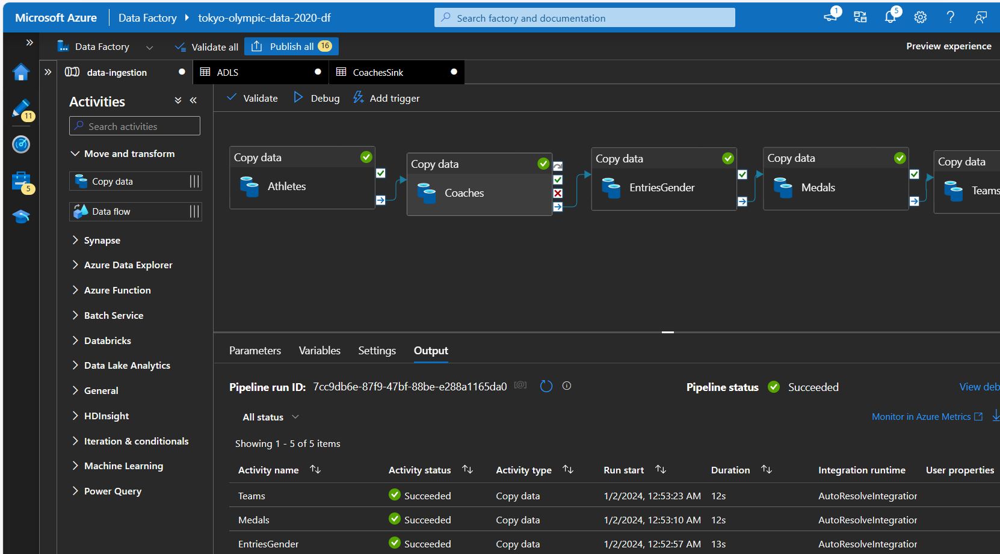
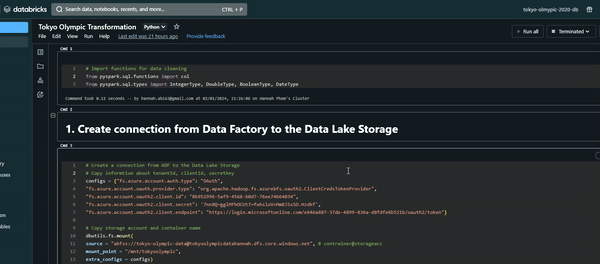
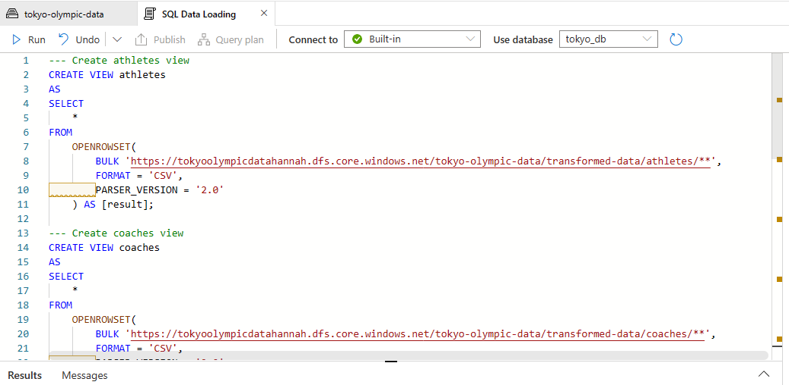
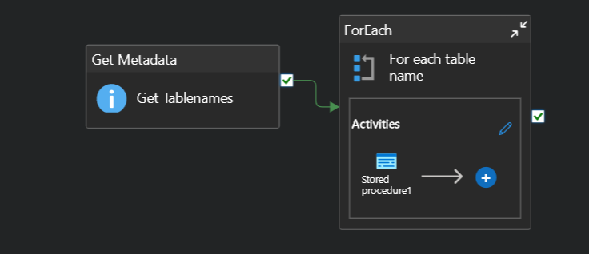
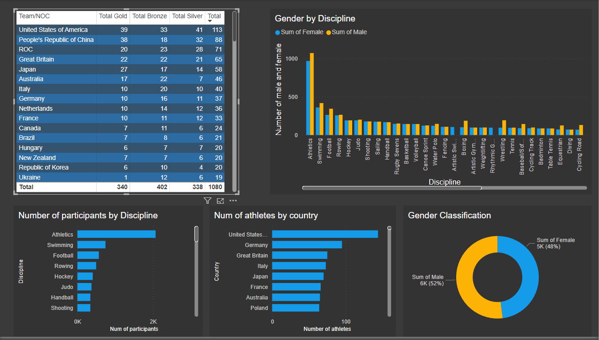

## Olympics-Data-Analysis-Azure-Data-Engineering-Project

### Overview
- This project is to anslyse Olympics Data using a variety of Azure resources, including including Azure Data Factory, Data Lake Gen 2, Synapse Analytics, and Azure Databricks.
- Some data analysis questions:
  1. Which countries do most athletes come from?
  2. Which discipline is most popular and which country has the highest participants in it?
  3. Which country produces highest number of coaches?
  4. Gender across disciplines
  5. Which country recieved most gold medals? Which recieved most silver and most bronze? Which received least for each?
### Learning Objectives 
- This project serves as a learning opprtunity for common data engineering practices, focusing on ETL pipelines techniques. The skills sharpened here are availables for small to medium-sized businesses aiming to migrate their local data to the cloud. 
### The tools that are covered in this project:
1. **Azure Data Factory(ADF)** - to ingest the dataset over HTTP
2. **Azure Data Lake Storage Gen2** - to store the RAW data
3. **Azure Databricks** - to transform the RAW data to the most cleanest form of data
4. **Azure Synapse Analytics** - to load the clean data
5. **Microsoft Power BI** - build an interactive dashboard. 
### Complete Project Execution 
#### Step 1: Data Ingestion using ADF
- **Build a pipeline:** A pipeline orchestrates the movement and transformation of data; then add a Copy Data activity to the pipeline.
- **Configure Source Dataset:** In the Copy Data activity, configure the source dataset to point to the HTTP server. Specify the HTTP linked service (URL).
- **Configure Destination Dataset:** Configure the destination dataset to point to the raw data folder in the Azure Data Lake Storage Gen 2. 
- **Debug and Validate:** Test the pipeline by running it in debug mode. Validate that data is ingested from the HTTP server successfully.
  

#### Step 2: Data Transformation 
- Use the Azure Databricks workspace to mount the ADLS Gen2 storage account to make it accessible from Data Factory, providing sonme authentication in the backend (App Registrations)
- Using Apache Spark to quickly clean the data
  
- 

#### Step 3: Data Loading to Azure Synapse Analytics 
- Data from the Azure Data Lake Gen2 is loaded into Microsoft Power BI in Azure Synapse Workspace. There are two way to do it:
  1. Writing the SQL scripts to create and store views for all individuals tables within serverless SQL database
     
  
 
  3. Create **a pipeline in Synapse Analytics** that dynamically create the views for all tables:
     * Create a store procedure that dynamically create the views for all the tables in Data Lake (see the 'stored procedure.sql' script)
     * In Manage tab, create a new link service to connect to the SQL Database in Synapse. This link service connection is to access the stored procedure created earlier

#### Step 4: Data Reporting 
Power BI connect to the AZURE Synapse Analytics - serverless SQL database. Th report is developed to visualise Tokyo Olympic dataset. 
 
